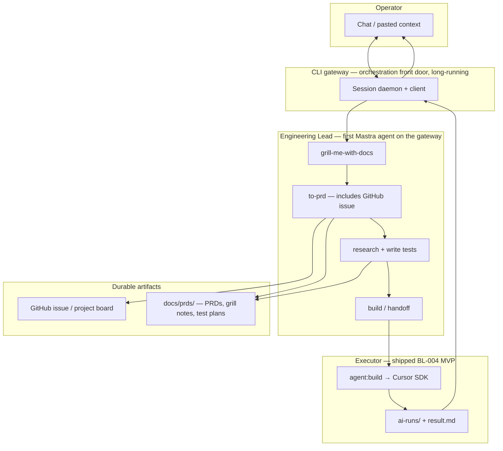

# Phase 2: Engineering loop (north star)

This document captures the **operator-aligned** definition of Phase 2 completion, synthesized from the grill session (2026-06-27). It supersedes the narrow “CLI `agent:build` only” interpretation of BL-004 while preserving what was already shipped.

## North star user story

> As the operator, I start a **local CLI gateway** that stays running. I describe work in chat (or paste context from another chat). The **Engineering Lead** agent runs a **skill pipeline** — grill, PRD, tests, handoff — with my approval at each step. Each step produces a deliverable on disk and runs in its **own thread**. Planning artifacts and code land **separately**. When I approve a build, the agent calls the **Cursor executor** (`agent:build`). I receive a structured report (summary, diff skim, failure detail when red). Only on **green**, I am asked whether to **push implementation to `main`**.

This is the milestone where **the harness becomes the entry point** and Cursor becomes an internal executor.

## Naming

- **Engineering Lead** — the first production Mastra agent. Owns the engineering loop (grill → PRD → tests → handoff → report). This is what the operator talks to and what docs/code reference.
- **CLI gateway** — the long-running orchestration front door. The Engineering Lead is the first agent registered on it; future agents (delegation, sub-agents — see [init.md](../init.md) Phases 4/8) attach to the **same** gateway. The gateway is *not* the Engineering Lead process; it hosts agents.

## Architecture

**Already built (executor layer):** `npm run agent:build` — spec generation inside the pipeline, isolated worktree, RED/GREEN gates, preflight, `result.md`. See [ADR 0003](./adr/0003-cursor-coding-executor.md).

**Still to build (orchestration layer):** gateway, Engineering Lead agent, skills, GitHub/issue tools, handoff into `agent:build`, report formatting, ship-to-main on approval.

## Grill session decisions

| Topic | Decision |
|-------|----------|
| Agent name | **Engineering Lead** — first production agent on the gateway |
| Entry point | **CLI gateway** — long-running session (daemon + client), OpenClaw/Hermes style. Front door for *all* future agents, not just Engineering Lead |
| Gateway lifecycle | **Manual start in Phase 2**; target **always-on Mac service by Phase 3** (you only run "chat"). Service design documented now to avoid rework |
| How work starts | **Chat-first** — paste from ChatGPT or other chats directly into gateway |
| Canonical spec | **Attached spec / PRD** produced by agents (not raw chat alone) |
| Durable docs | **`docs/prds/`** for now (PRDs, grill notes, test plans). Migrate to second brain / wiki in Phase 9 |
| Conversation model | **New thread per step** — each skill ends with a deliverable on disk; the next step reads prior deliverables instead of carrying chat context (keeps context lean) |
| GitHub issue timing | **Default:** issue filled when `to-prd` completes. **Early shell:** optional tracking issue on pause or when operator asks — same issue enriched over time |
| Pipeline pacing | **Checkpointed (D)** — agent asks before tests, before build, before push; autopilot deferred |
| Tests deliverable | **D + test plan** — `research-write-tests` writes a short test plan into the PRD plus **one hash-locked acceptance test** (trust anchor). Cursor writes its own unit tests in its inner loop. Full pre-written suites deferred |
| Build report | **D+** — always headline; diff skim on green; auto detail on red; **no push prompt on red** |
| Push scope | **Separate commits** — planning docs pushed when PRD is ready; implementation pushed only after green build (so failed/paused builds do not block doc persistence) |
| Push target | **`main`** after explicit YES and green report (PR-based flow deferred) |
| Approval | **Conversational YES/NO** in gateway thread (runtime gating per BL-003 later) |
| Resume work | **All paths** — by GitHub issue (`resume #N`, canonical bookmark), by feature name, or a "what's in progress?" list |
| Phase 3 | **Minimal slice now** — skill folder convention + invocable skills for one agent; full department/YAML platform remains Phase 3 proper |

## Skill pipeline (Matt Pocock–inspired)

| Skill | Purpose | Typical output |
|-------|---------|----------------|
| **grill-me-with-docs** | Pressure-test intent; resolve ambiguity (accepts pasted chat context) | Grill notes in `docs/prds/` |
| **to-prd** | Durable plan + tracking | PRD in `docs/prds/`; GitHub issue body created/updated |
| **research + write tests** | Define “done” before implementation | **Test plan** section in PRD + **one acceptance test** (hash-locked trust anchor) |
| **build / handoff** | Bundle PRD + acceptance test + issue context | Invokes `agent:build` / Cursor |

**Test ownership split:**

| Test | Owner | Locked? |
|------|-------|---------|
| Acceptance test (1) | Engineering Lead / operator | Yes — RED/GREEN trust anchor |
| Unit tests (many) | Cursor inner loop (TDD skill) | No — Cursor's working tests |

Skills are **committed `SKILL.md` files** (minimal Phase 3), not the full Phase 6 YAML platform. See [skills/README.md](../skills/README.md).

### Checkpoint prompts (v1)

After each skill, the agent stops and asks, for example:

- “PRD is ready — commit planning docs and update the issue?”
- “Ready to research and write tests?”
- “Ready to hand off to Cursor?”
- (After green report only) “Push implementation to `main`?”

## GitHub issue lifecycle

| Stage | Board column | Issue state |
|-------|--------------|-------------|
| Optional early capture | Backlog | Thin shell (`spec-wip`); “planning in progress” |
| `to-prd` complete | Backlog → Ready | Full body: requirements + acceptance criteria |
| Build-handoff running | In Progress | Linked run in `ai-runs/` |
| Implementation on `main` | Done | Close via commit message or manual |

The issue is the **canonical bookmark** for a paused or multi-session feature. Resume via `resume #N`, by feature name, or by asking for the "what's in progress?" list.

## Delivery slices (suggested order)

1. **Minimal Phase 3 plumbing** — skill folder convention; Engineering Lead registered on Mastra; one skill invocable
2. **CLI gateway** — daemon + client; new-thread-per-step; manual start (service design noted for Phase 3)
3. **grill-me + to-prd** — chat/paste input; PRD in `docs/prds/` + GitHub issue; **commit docs separately**
4. **research + write tests** — test plan in PRD + one acceptance test fed to handoff (may thin `agent:build` internal spec-agent over time)
5. **build / handoff** — wrap existing `agent:build`; D+ report in chat
6. **ship** — push implementation to `main` on YES (green only)
7. **resume** — `resume #N` / by name / in-progress list

## Phase 2 complete when

- [ ] Operator can start gateway and talk to the **Engineering Lead** (not `npm run agent:build` directly)
- [ ] Paste-in-chat context works for grill
- [ ] Skill chain runs with checkpoint approvals, **new thread per step**, deliverables on disk
- [ ] `to-prd` writes PRD to `docs/prds/` + creates/updates GitHub issue
- [ ] `research-write-tests` writes test plan + one hash-locked acceptance test
- [ ] Planning docs can be committed **before** a successful build (separate from code)
- [ ] Handoff runs `agent:build` and returns D+ report in chat
- [ ] Push-to-main only on green + explicit YES
- [ ] Resume works via `resume #N`, feature name, and in-progress list
- [ ] Documented Phase 3 debt (formal skill platform, multi-agent dept, sessions, PR flow, always-on service)

## Phase 3 debt (document now, deepen later)

- Full agent registry and Engineering Department agents; multi-agent delegation + sub-agents ([init.md](../init.md) Phases 4/8)
- YAML skill platform (Phase 6)
- Session persistence / job queue (Phase 4)
- Always-on gateway as a Mac service (target by Phase 3; Phase 2 starts it manually)
- PR-based ship instead of direct-to-main (Phase 5 preview)
- Runtime approval gating (BL-003)
- File-path spec input (v1 is paste-in-chat)
- Move PRDs from `docs/prds/` into the second brain / wiki (Phase 9)
- Pre-written full test suites beyond the single acceptance test

## Related

- [BL-004 / issue #2](https://github.com/mikebrowne/michael-os/issues/2)
- [ADR 0003 — Cursor coding executor](./adr/0003-cursor-coding-executor.md)
- [init.md Phase 2](../init.md) — original user stories (partially superseded by this doc for orchestration shape)
