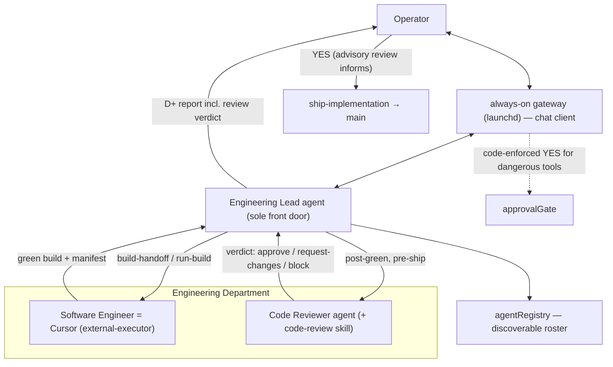

# Phase 3: Engineering Department (north star)

This document captures the **operator-aligned** Phase 3 plan for MichaelOS, synthesized from the
grill session on 2026-06-27. It builds on [Phase 2](./phase-2-engineering-loop.md) (engineering
loop complete) and refines [BL-005 / issue #3](https://github.com/mikebrowne/michael-os/issues/3).

**Status:** planning / decision-lock. No implementation has started. Slices below are ordered for
build once the operator says "start building."

## North star user story

> As the operator, I run an **always-on engineering gateway** and chat with the **Engineering
> Lead**. The Lead drives the loop (grill → PRD → tests → build → report → ship) and now hands the
> green build to a **Code Reviewer** agent before I'm asked to ship. The Reviewer inspects the diff
> against the PRD and acceptance test and returns a structured verdict (approve / request-changes /
> block) with specific findings. I see that verdict in the report, then decide whether to ship to
> `main`. The department's available agents are discoverable through an **agent registry**, and a
> paused green build can be **resumed in a later session and shipped** without rebuilding.

Phase 3 turns the single-agent loop into a **small department**: a registry, a real second agent
(the Reviewer), the SWE role made explicit (Cursor), always-on ops, and cross-session ship
reliability.

## Roster — who is in the Engineering Department

Every role is a **role (who)** realized by a **kind (how)**. Only `mastra-agent` kinds are
conversational / directly chat-eligible; `external-executor` does bounded work; `skill` is judgment
loaded onto an agent.

| Role (who) | Kind (how) | Phase 3 status | Tools / skills | Gateway relationship |
|------------|-----------|----------------|----------------|----------------------|
| **Engineering Lead** | `mastra-agent` | shipped (P2) | all engineering tools; loads 5 skills | **sole front door** |
| **Software Engineer** (a.k.a. SWE / programmer) | `external-executor` (Cursor, `runAgentBuild`) | shipped (P2) | `run-build` / `build-handoff` | invoked by EL; never chatted with directly |
| **Spec / Planning / Test** | `skill` on EL | shipped (P2) | `grill-me-with-docs`, `to-prd`, `research-write-tests` | inside EL loop |
| **Code Reviewer** | `mastra-agent` + `code-review` skill | **NEXT HIRE (build)** | reads diff/PRD/acceptance test; emits verdict | called by EL **post-green, pre-ship** |
| **Necessity Reviewer** (Ponytail) | `mastra-agent` + skill | **deferred → P4** | "should we build this?" verdict | n/a yet |
| **Debugger** | `skill`/agent | deferred | reactive; Cursor already does inner RED→GREEN | n/a |
| **Security** | `skill`/agent | deferred → P5 | overlaps Reviewer at small scale | n/a |
| **DevOps** | ops slice (not an agent) | **build (always-on gateway)** | launchd service | the daemon itself |

### Naming note: "Implementation Agent" retired

init.md lists an "Implementation Agent." That name describes a *function*, not a *role*, and could
mean anything. It is retired in favor of **Software Engineer (SWE)** — the role that writes code —
**performed by Cursor** as an `external-executor`. init.md traceability: *init.md Implementation
Agent = the SWE role, executed by Cursor.*

## Gateway routing decision

**Phase 3: single front door.** The operator always chats with the Engineering Lead. Department
agents (the Reviewer) are invoked via handoff, not direct chat. The `agentRegistry` reserves fields
(`directChat`, `standalone`) so **Phase 4** can add multi-route chat — e.g. a grill-only session
that never wakes the Lead — as a config flip + REPL change, not a refactor.

- **Standalone-eligible** agents need no active work item (grill, future Necessity Reviewer, and the
  Reviewer in "review these changes" mode).
- **Work-item-bound** agents require an active item (build-handoff, ship).
- The registry encodes this, because it is exactly what gates whether an agent is safe to talk to
  directly later.

## Architecture

**Loop change vs Phase 2:** a new **review stage** sits between GREEN and ship. The Reviewer's
verdict is **advisory** in Phase 3 — it informs the report; the operator's YES still ships.

## Decisions (grill session 2026-06-27)

| # | Topic | Decision | Rationale |
|---|-------|----------|-----------|
| 1 | Gateway routing | **Single front door** (EL only); registry reserves `directChat`/`standalone` for P4 | Prove registry + 2nd agent without rebuilding conversation routing |
| 2 | "Implementation Agent" | **= Software Engineer (SWE), realized by Cursor** as `external-executor`; name retired | Role vs function; never a chat agent |
| 3 | Ponytail / Necessity Review | **Deferred → Phase 4** | Most valuable once builds are expensive; not the first gap |
| 4 | Next hire | **Code Reviewer** (`mastra-agent` + `code-review` skill) | Biggest unguarded gate: today green build = ship, nothing reviews the diff |
| 5 | Reviewer authority | **Advisory** — verdict informs report; operator YES still ships | Earn trust first; gating → P4/P5 + BL-003 |
| 6 | Slice 1 | **Reviewer first**, then daemon, then resume→ship hardening | Build the architecturally novel thing while context is hot |
| 7 | Registry home | **Code-defined `src/mastra/agentRegistry.ts`** (`AgentRegistration[]`), not data file | Deterministic config + live factory refs; YAML data = Phase 6 (#6) |
| 8 | Naming convention | **No bare generics; `<domain>Registry` / `<Domain>Registration`**; enforced via Cursor rule + AGENTS.md | Registries/managers/contexts will multiply; self-policing |
| 9 | Model per agent | **Optional `model?` per `AgentRegistration`**; Reviewer = reasoning-tier, EL = default | Review is highest-judgment task; tune cost/quality per role |
| 10 | Model strings | **Tier named in plan; exact model resolved from config/`.env`** | Avoid churn + keep secrets/config out of tracked docs |
| 11 | Resume → ship | **Persist build manifest; rehydrate on resume; ship only if worktree exists + green + acceptance-hash matches** | Fixes P2 blocker without wasteful rebuild; preserves RED/GREEN trust anchor |
| 12 | Observability | **Minimal agent-scoped JSONL events now**; rich tracing deferred → BL-010 (#8) | Build rule #7 satisfied cheaply; consistent with existing Run logs |

## Naming convention (cross-cutting)

**Principle: no bare generic container names.** Generic nouns (`registry`, `manager`, `handler`,
`service`, `context`, `session`, `store`, `loader`, `config`, `util`/`helper`) must be
domain-qualified.

- **File:** `camelCase`, domain noun first — `agentRegistry.ts`, never `registry.ts`.
- **Type:** `PascalCase`, domain-qualified — `AgentRegistry`, `AgentRegistration`; never bare
  `Registry`/`Entry`.
- **Symmetry:** all registries follow `<domain>Registry` + `<Domain>Registration`
  (`agentRegistry`/`AgentRegistration`, future `skillRegistry`/`SkillRegistration`,
  `jobRegistry`/`JobRecord`).
- Already compliant: `gatewaySession.ts`, `agentMemory.ts`, `skillLoader.ts`.

To be enforced via `.cursor/rules/naming-conventions.mdc` (always-applied) with a pointer in
`AGENTS.md`.

## Delivery slices (thin vertical, ordered)

### Slice 1 — Agent registry + Code Reviewer (highest-value proof)

- **Goal:** discoverable roster + a real second agent wired into the loop, post-green/pre-ship.
- **Likely files:** `src/mastra/agentRegistry.ts` (new, `AgentRegistration[]`),
  `src/mastra/agents/code-reviewer.ts` (new), `skills/code-review/SKILL.md` (new),
  `src/mastra/index.ts` (register reviewer), `src/mastra/agents/engineering-lead.ts` (call reviewer
  after green), `src/mastra/tools/engineering/index.ts` (review handoff + verdict in report),
  `skills/README.md` (document new skill), telemetry events in `src/logging/`.
- **Acceptance criteria:**
  - `agentRegistry` lists EL, SWE (external-executor), and Code Reviewer with role + kind + tier.
  - After a green build, EL invokes the Reviewer and surfaces `approve/request-changes/block` +
    findings in the D+ report **before** the ship prompt.
  - Verdict is advisory: operator YES still required to ship.
  - Emits `agent.invoked` + `review.verdict` JSONL events.
- **Issue title:** `[BL-005a] Agent registry + Code Reviewer agent (post-green review gate)`

### Slice 2 — Always-on gateway (Mac service)

- **Goal:** operator only runs a chat client; the gateway runs as a managed service.
- **Likely files:** launchd plist (e.g. `ops/launchd/com.michaelos.gateway.plist`),
  `docs/local-dev.md` (service install/uninstall), small start/health script; `scripts/gateway.ts`
  (graceful restart / health output).
- **Acceptance criteria:** gateway auto-starts on login, restarts on crash, logs to `./.logs/`;
  documented install/uninstall; no secrets in the plist (env via `.env`).
- **Issue title:** `[BL-005b] Always-on gateway as a Mac launchd service`

### Slice 3 — Resume → ship hardening

- **Goal:** ship a prior-session green build after `resume #N` without rebuilding.
- **Likely files:** build manifest writer in `runAgentBuild` path,
  `src/engineering/workItem.ts`, `src/engineering/gatewaySession.ts` (rehydrate
  `lastBuildResult`), `src/mastra/tools/engineering/index.ts` (`ship-implementation` guard).
- **Acceptance criteria:** `run-build` writes a manifest (worktree path, green status,
  acceptance-test hash, base commit); resume rehydrates it; `ship-implementation` proceeds only if
  worktree exists **and** status green **and** hash matches — else refuses and prompts rebuild.
- **Ships via:** Cursor/operator (harness internals), not the feature loop.
- **Issue title:** `[BL-005c] Resume hydrates green build for cross-session ship`

### Slice 0 (chore, do alongside Slice 1) — Naming convention rule

- **Goal:** enforce naming so registries/managers/contexts stay descriptive.
- **Likely files:** `.cursor/rules/naming-conventions.mdc` (new), `AGENTS.md` (pointer).
- **Acceptance criteria:** rule is always-applied; `agentRegistry.ts` is the first compliant new
  file; existing compliant files noted.
- **Issue title:** `[BL-005d] Naming convention rule for domain-qualified modules`

## In scope (Phase 3)

- Agent registry (code-defined).
- Code Reviewer agent + `code-review` skill (advisory, post-green).
- Software Engineer role made explicit in the registry (Cursor as external-executor).
- Always-on gateway as a Mac service.
- Resume → ship hardening (build manifest + guarded rehydrate).
- Minimal per-agent JSONL telemetry.
- Naming convention rule.

## Out of scope (later phases)

- Necessity Reviewer / Ponytail → Phase 4.
- Multi-route gateway / direct operator→agent chat → Phase 4 (#4, fields reserved now).
- Delegation jobs / job queue → BL-006 (#4).
- PR-based ship / staging / rollback → BL-007 (#5).
- YAML skill platform / data-driven registry → BL-008 (#6).
- Runtime approval gating (hard gates) → BL-003 (#1).
- Rich Mastra tracing → BL-010 (#8).
- Debugger / Security agents → deferred.

## Phase 3 complete when

- [x] `agentRegistry` lists all department agents with role, kind, and model tier.
- [x] Code Reviewer is wired and usable from the gateway, running post-green/pre-ship.
- [x] Reviewer verdict (advisory) appears in the D+ report before the ship prompt.
- [x] Always-on gateway is documented and runnable as a Mac service.
- [x] `resume #N` can ship a prior green build (manifest rehydrate + green/worktree/hash guard).
- [x] Every registry agent emits at least `agent.invoked` + an outcome event (JSONL).
- [x] Naming convention rule committed and applied to new files.
- [x] This north star doc exists and is current.

## Phase 2 hardening backlog (carried in)

- **Resume → green build hydration** — addressed by Slice 3 (manifest + guarded rehydrate).
- **Approval retry reliability** — after YES, the dangerous tool must re-run with the *same* args
  deterministically; store pending tool args in code rather than relying on the agent to remember
  them.
- **Harness vs loop ship boundaries** — harness changes (memory, gateway, registry, manifest) ship
  via **Cursor/operator**; feature work ships from the worktree via the loop. Slice 3 and the daemon
  are harness changes.

## GitHub artifacts

Epic [#3 (BL-005)](https://github.com/mikebrowne/michael-os/issues/3) with child issues:

| Issue | Title |
|-------|-------|
| [#13](https://github.com/mikebrowne/michael-os/issues/13) | BL-005a — Agent registry + Code Reviewer |
| [#14](https://github.com/mikebrowne/michael-os/issues/14) | BL-005b — Always-on gateway (launchd) |
| [#15](https://github.com/mikebrowne/michael-os/issues/15) | BL-005c — Resume → ship manifest |
| [#16](https://github.com/mikebrowne/michael-os/issues/16) | BL-005d — Naming convention rule |

## Related

- [BL-005 / issue #3](https://github.com/mikebrowne/michael-os/issues/3)
- [docs/phase-2-engineering-loop.md](./phase-2-engineering-loop.md)
- [skills/README.md](../skills/README.md)
- [ADR 0003 — Cursor coding executor](./adr/0003-cursor-coding-executor.md)
- [ADR 0004 — Engineering Department structure](./adr/0004-engineering-department-structure.md)
- [ADR 0005 — Agentic orchestration layer](./adr/0005-agentic-orchestration-layer.md)
- [ADR 0006 — Gateway session memory](./adr/0006-gateway-session-memory.md)
- [init.md Phase 3](../init.md)
