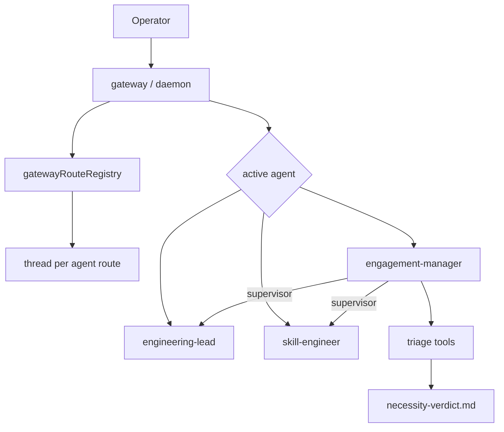

# Phase 4b: Multi-Agent Chat and the Engagement Manager (north star)

A single conversational front door that can talk to more than one agent, with a coordinator — the
**Engagement Manager** — that routes incoming work and runs build-vs-reuse triage.

## North star user story

> As the operator, I open the gateway and talk to the **Engagement Manager** — the engineering front
> door. I describe what I need; the EM restates it, runs **build-vs-reuse triage** (registries,
> comprehension, framework-first), records a **necessity verdict** (build / reuse / adapt), and routes
> me to the right specialist. I can **`@switch`** to talk directly to the Engineering Lead or Skill
> Engineer when I want to skip intake. Each direct-chat agent keeps its **own conversation thread** so
> context does not bleed across roles.

## Core principle: framework-first

| Phase 4b need | Mastra / existing primitive | What we still own |
|---|---|---|
| Multi-agent chat | Mastra Memory `{ thread, resource }` per route | `gatewayRouteRegistry` projection + `@agent` UX |
| Routing to specialists | **Supervisor agents** (`agents` map) | EM intake instructions + triage orchestration |
| Reuse discovery (judgment) | `runComprehension` (Phase 6.5) | EM-specific prompts + cite-and-verify glue |
| Reuse discovery (deterministic) | `agentRegistry` + `skillRegistry` | keyword scan tool |
| Agent registration | Committed bundles ([ADR 0014](./adr/0014-agent-bundles-dynamic-registration.md)) | EM bundle + `directChat` flags |

## Architecture

- **`gatewayRouteRegistry`** — thin wrapper over `.mastra/gateway-routes.json`: active agent id +
  per-route Mastra thread ids.
- **Engagement Manager** — employee supervisor; intake → triage → route; invokes `author-policy` skill.
- **Direct-chat route** — one registered agent with `directChat: true` that the operator may `@switch` to.
- **Necessity verdict** — reviewable markdown artifact + `necessity.verdict` run-log event.

## The nouns

- **Engagement Manager** — coordinator agent; engineering front door; rename of Ponytail / Necessity Reviewer.
- **Direct-chat route** — a registry agent the operator may talk to directly via `@<agent-id>`.
- **Build-vs-reuse triage** — three-source check: registries, comprehension, framework-first.
- **Necessity verdict** — recorded `build | reuse | adapt` decision with rationale and sources.
- **`gatewayRouteRegistry`** — active route + per-agent thread map (anti-corruption over gateway state).

## Decisions (grill session 2026-07-01)

Full record in [grill notes](./prds/phase-4b-multi-agent-chat.grill.md). Headlines:

- **D1** EM default front door; `@engineering-lead` rollback via env.
- **D2** `@<agent-id>` switching; `agents` command.
- **D3** One thread per direct-chat route ([ADR 0015](./adr/0015-multi-route-gateway-chat.md)).
- **D4** Shared daemon runtime; broadcast unchanged.
- **D5** Retire `skillGateway.ts`.
- **D6** EM as Mastra supervisor (EL + SE sub-agents).
- **D7** Three-source triage ([ADR 0016](./adr/0016-engagement-manager-triage-verdicts.md)).
- **D8** `necessity-verdict.md` + `necessity.verdict` event; `verdict` command.
- **D9** Reuse `author-policy` skill.
- **D10** Document CoS boundary (Phase 8).
- **D11** HITL / hard gating / checklist out of scope.

## Delivery slices (thin vertical, ordered)

### Slice 0 (chore) — ADRs + vocabulary
ADR 0015 + 0016; `CONTEXT.md` nouns; `docs/README.md` backlog; naming.

### Slice 1 — Multi-route gateway
`gatewayRouteRegistry`; `@agent` + `agents`; per-route threads; retire `skill-gateway` script.

### Slice 2 — Engagement Manager agent
`agents/engagement-manager/` bundle; Mastra registration; default gateway agent.

### Slice 3 — Routing
Supervisor sub-agents (EL + SE); routing by role/skill/authority from registries.

### Slice 4 — Build-vs-reuse triage
Registry scan, comprehension, framework-first judgment tools on EM.

### Slice 5 — Necessity verdict
`necessity-verdict.md` persistence; `necessity.verdict` telemetry; `verdict` command.

### Slice 6 — North-star verification
Hash-locked acceptance test; docs + `agents/README.md`; CoS boundary section.

## Testing the north star

### A. Deterministic machinery tests (CI, no secrets)

- `@skill-engineer` switches active route and uses a distinct thread id.
- `agents` lists only `directChat: true` registry entries.
- Registry scan returns deterministic matches for fixture keywords.
- Triage writes `necessity-verdict.md` with expected schema.
- Hash-locked acceptance test green.

### B. Local-only evals (real model)

- EM triages a known-existing skill → `reuse` verdict with registry source cited.
- EM routes a build request to Engineering Lead after `build` verdict.

## Chief of Staff boundary (Phase 8)

| Capability | Engagement Manager (4b) | Chief of Staff (8) |
|---|---|---|
| Scope | Engineering department | Whole organization |
| Routing | Simple role/skill/authority | Intelligent context routing |
| Triage | Build-vs-reuse (3 sources) | Org-wide priority + delegation |
| Summaries | None | Delegation summaries |
| Memory | Per-route gateway threads | Org-wide operator context (future) |

Phase 4b **does not** duplicate Phase 8; it is the engineering-scoped precursor.

## In scope (Phase 4b)

- Multi-agent gateway (`@agent`, `agents`, per-route threads).
- Engagement Manager agent + supervisor routing.
- Build-vs-reuse triage (registry + comprehension + framework-first).
- Necessity verdict artifact + telemetry.
- Chief of Staff boundary documentation.

## Out of scope (→ 4c / later)

- HITL raise-to-operator + multi-channel.
- Hard review gating; generalized checklist.
- Streaming token replies; multi-operator isolation.
- Debugger / Security / Spec roster (Phase 4c).

## Phase 4b complete when

- [x] Operator can `@switch` between all `directChat` agents; each route has its own thread.
- [x] Engagement Manager is the default gateway agent.
- [x] EM runs triage and writes `necessity-verdict.md` + emits `necessity.verdict`.
- [x] EM routes to EL or Skill Engineer via supervisor delegation.
- [x] `skill-gateway` script retired; Skill Engineer reachable via main gateway.
- [x] ADR 0015 + 0016 + vocabulary committed; hash-locked acceptance test passes in CI.
- [x] This north star doc marked **complete**.

**Status:** **complete** (shipped 2026-07-01). Epic **BL-015** (issues _to file_ — see [issues doc](./prds/phase-4b-multi-agent-chat.issues.md)).

## Related

- [init.md Phase 4b](../init.md)
- [PRD](./prds/phase-4b-multi-agent-chat.md)
- [grill notes](./prds/phase-4b-multi-agent-chat.grill.md)
- [Phase 3 north star](./phase-3-engineering-department.md)
- [Phase 6 skill platform](./phase-6-skill-platform.md)
- [Phase 6.5 steerable loop](./phase-6.5-steerable-loop.md)
