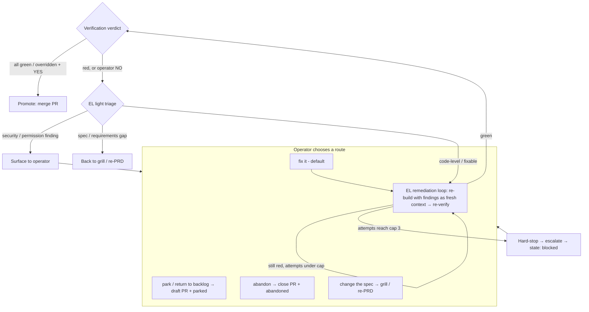

# Phase 5: Staging, Review, and Promotion (north star)

This document captures the **operator-aligned** Phase 5 plan for MichaelOS, synthesized from the
grill session on 2026-06-28 ([grill notes](./prds/phase-5-staging-review-promotion.grill.md)). It
builds on [Phase 4](./phase-4-delegation-jobs.md) (delegation + Jobs + observability) and realizes
the init.md Phase 5 goal: **every generated change is staged, reviewed, validated, and promotable.**

**Status:** **planned**. Epic BL-007 / issue [#5](https://github.com/mikebrowne/michael-os/issues/5).

## Guiding principle

> The Engineering Department should **run like a real software-building agency** — professional
> practices, not shortcuts: real pull requests, real review gates, real CI, clean revert-based
> rollback, and controlled restarts.

## North star user story

> As the operator, when a green build is ready, the **Engineering Lead does not push to `main`**.
> It **stages** the change as a reviewable diff (a branch + PR), delegates a single
> **`build-verification` Job** to the **QA Engineer**, who runs blocking-but-overridable **gates**
> (CI, code review, security review, permission review) and returns **one composite verdict**. The
> Lead folds that into my D+ report as a **single promotion decision**: I say YES (optionally
> overriding a specific failing gate, which is logged) and the change is **promoted** — the PR is
> merged to `main`. If anything looks wrong later I **roll it back** with one command
> (`rollback #N`). When a promoted change touches the harness itself, a **controlled restart** drains
> in-flight Jobs, brings the harness back on the new code, and tells me in chat when it's down and
> back up.

Phase 5 turns Phase 4's *advisory* review into a **real promotion pipeline**: staged diffs, a
consolidated **QA Engineer** verification gate, CI integration, operator-approved promotion, an
auditable promotion ledger, one-command rollback, and a controlled restart.

## Core principle: framework-first

Before building any custom primitive, check the framework docs and the **installed** version first.
Phase 5 reuses what already exists and keeps a thin domain layer on top:

| Phase 5 need | Reused primitive | What we still own |
|--------------|------------------|-------------------|
| Delegation (EL → QA Engineer) | Mastra **supervisor agents** (Phase 4) | Verification intent; clearance rules |
| Verification ordering | Mastra **workflow** (deterministic step ordering) | The gate set + composite verdict schema |
| Job execution | Phase 4 `jobRunner` (synchronous, interactive) | `build-verification` Job semantics |
| Staging / promotion | **git** + **GitHub PRs** (`gh`) | `GitRunner`/`GhRunner` wrappers; promotion semantics |
| Promotion history | **git** commits | `promotionRegistry` / `PromotionRecord` projection |
| Restart | OS **process supervisor** (launchd) | Graceful drain + lifecycle messages |
| Observability | Phase 4 telemetry + daemon→client bus | Gate/override/promotion events |

> The QA Engineer **assesses**; only the Engineering Lead (management) **promotes** — and only with
> operator YES. Separation of duties is structural, via Phase 4 clearance.

## The nouns (Issue / WorkItem / Job / Promotion)

```
GitHub Issue  #5         ← public identity / bookmark (GitHub, system of record)
      │ 1:1
   WorkItem  "<slug>"     ← private feature lifecycle (stateDir, gitignored)
      │ 1:many
   Job: "build-verification <hash>"  → delegatedTo: qa-engineer
      │                                  output: { gates: [...], overall }
      │ 0:1 (on promote)
   PromotionRecord  → commit SHA, gates passed/overridden, links Issue/WorkItem/Job
```

- **Staging / staged change** — a built change pushed as a branch + PR; the PR diff is the reviewable
  staged diff.
- **Gate** — a blocking-by-default, operator-overridable pass/fail check (CI, code review, security
  review, permission review).
- **QA Engineer** — the **employee** agent (upgrade of the Phase 4 Code Reviewer) that runs the
  verification workflow and returns the composite verdict. A role that accretes more QA skills later.
- **Promotion** — merging a verified staged change to `main` after operator approval (distinct from
  "ship").
- **PromotionRecord / promotionRegistry** — the ledger projecting promotions over git.
- **Rollback** — `git revert` of a promotion commit.

Definitions are recorded verbatim in [`CONTEXT.md`](../CONTEXT.md).

## Architecture

```mermaid
flowchart TB
  OP[Operator] <--> CLIENT["thin chat client"]
  CLIENT <--> DAEMON["always-on gateway daemon"]
  DAEMON <--> EL["Engineering Lead (supervisor, management)"]
  DAEMON -.->|"job + promotion + restart headlines"| CLIENT

  EL -->|"green build → stage"| STAGE["GitRunner/GhRunner: branch + PR"]
  EL -->|"build-verification Job"| QA["QA Engineer (employee)"]

  subgraph verify [Deterministic verification workflow]
    direction LR
    CI["CI gate (tool)"] --> PERM["permission scan (tool)"] --> CR["code review (skill)"] --> SEC["security review (skill)"] --> AGG["aggregate verdict"]
  end
  QA --> verify
  verify -->|"composite verdict"| EL
  EL -->|"D+ report: single promotion blocker"| OP
  OP -->|"YES (+ per-gate override)"| EL
  EL -->|"promote = merge PR + record"| PROM["promotionRegistry"]
  EL -->|"rollback #N = git revert"| PROM
  EL -.->|"src/** promoted → suggest restart"| OP

  subgraph store [LibSQL .mastra/ (gitignored)]
    JOBS["jobRegistry / JobRecord"]
    PROMS["promotionRegistry / PromotionRecord"]
  end
  QA --> JOBS
  PROM --> PROMS
```

The EL stays the sole front door and the only agent that can stage/promote/rollback/restart
(management). The QA Engineer is an employee: it assesses but cannot deploy.

## Decisions (grill session 2026-06-28)

| # | Topic | Decision | Rationale |
|---|-------|----------|-----------|
| 1 | North star | Stage → QA-verify → CI → operator-approved promote → rollback → restart | Run like a professional agency |
| 2 | Promotion mechanism | **PR-based**: stage = branch+PR; promote = merge after gates+YES | GitHub is the build system of record; clean rollback |
| 3 | Gating model | **Blocking by default, operator-overridable**; override logged | Real gates without locking the operator out |
| 4 | Gate architecture | **One QA Engineer** employee agent runs a **deterministic verification workflow**; one composite `build-verification` Job | One delegation surface, one operator decision; gates can't be skipped |
| 4a | Gate ↔ kind split | CI + permission scan = **tools** (deterministic); code + security review = **skills** (judgment) | Determinism ratchet (`CONTEXT.md`) |
| 5 | Rollback / history | **`git revert`** + **`promotionRegistry`/`PromotionRecord`** ledger | One-command rollback; auditable; never force-push |
| 6 | Controlled restart | Graceful **drain → clean exit → launchd/supervisor relaunch**; EL suggests on `src/**`; **3 chat lifecycle messages** | Safe restart; operator always knows up/down state |
| 7 | CI integration | **Local CI gate to open PR** + **remote GitHub Actions green to merge** (overridable) | Fast local feedback + authoritative remote check |
| 8 | Permission review | **Deterministic diff scan** (dangerous tools, authority, deps, security/CI rails, code patterns) + thin judgment | Code for deterministic; flag capability expansion |
| 9 | Docs flow | **Docs ship directly** (unchanged); pipeline is implementation-only | No safety gain in gating low-risk docs |
| 10 | Testing | **Local bare-repo fake remote** + **`GhRunner`** + deterministic gate/scanner/restart tests + optional local real eval | Test the real mechanism, zero secrets |
| 11 | Authority | Stage/promote/rollback/restart = **management** (EL) + YES; QA Engineer = **employee** (cannot deploy) | Separation of duties; Phase 4 clearance |
| 12 | ADRs | **0007** promotion model + **0008** QA Engineer; restart in this doc | Two focused ADRs |
| 13 | Scope | Multi-env, auto-merge, standalone Security/DevOps agents, broader QA skills → **Phase 5b/later** | Keep the slice focused |
| 14 | Approval gating (BL-003) | **Option C**: reuse the simple gate for promote/rollback/restart but **log every approval + denial** | Accountability on-theme; full capability coverage stays a shrunken BL-003 |
| 15 | Red / NO path | **Kick back to the EL** with findings (not promoted, not discarded); PR stays draft; **four NO routes** (fix / re-spec / park / abandon); **EL owns remediation**; **light triage** → fix loop; **cap 3** → escalate `blocked` | A "no" means more work, not a dead end; bounded to avoid infinite loops |
| 16 | New states | Add **`staged`**, **`blocked`**, **`parked`** to the WorkItem lifecycle | Represent verification, escalation, and backlog-park |

## Rejection & remediation (the red / no path)

A "no" — a red gate (not overridden) or an operator NO — means **more work**, not a dead end. The
change is **not promoted and not discarded**; the QA Engineer's structured findings drive an EL-owned
remediation loop, and the staged PR stays open as a draft while red.



- **EL owns remediation** (no Debugger agent yet): it re-runs the build with the findings injected as
  remediation context, then re-submits for verification. Each cycle is a new Job under the WorkItem.
- **Cap = 3** attempts (configurable via config/`.env`); each attempt is operator-visible and runs
  from **fresh context + structured findings** (no transcript pile-up). Cap hit → hard-stop +
  escalate + state `blocked`.
- **Light triage first:** security/permission findings are always surfaced (never auto-fixed away);
  spec gaps escalate immediately (no wasted loop); only code-level reds enter the fix loop.
- **Four NO routes:** **fix** (default), **change the spec** (→ grill/re-PRD), **park** (→ backlog,
  work preserved), **abandon** (→ close PR, `abandoned`).
- **Parked:** branch kept; PR kept **open as draft + `parked` label**; issue stays open and moves to
  the **Backlog** column; resumable via `resume #N` / `list`.

### WorkItem lifecycle (Phase 5 additions)

```
grill → prd → tests → build → staged → done
                                  │  ▲       (promote)
                       (red/no)   ▼  │ (fix → re-verify, ≤ cap)
                              blocked │
                                  └───┘
   any non-terminal stage → parked (resumable) | abandoned (terminal)
```

New stages: **`staged`** (build green, PR open, verification running), **`blocked`** (cap hit / needs
operator decision), **`parked`** (set aside, resumable). `done` (promoted) and `abandoned` unchanged.

## Approval gating & BL-003 (Decision C)

Phase 5's new dangerous actions — **promote**, **rollback**, **restart** — reuse the existing simple
operator YES/NO gate, **upgraded to log every approval and denial** (with audit context) to the run
logs/telemetry. This satisfies the *audit* and *enforced-not-just-documented* parts of
**[BL-003](https://github.com/mikebrowne/michael-os/issues/1)** for these actions; the broader
capability coverage (shell, dependency install, file deletion, secrets, arbitrary external writes)
remains a **shrunken BL-003** for a later dedicated pass. This dovetails with the promotion ledger's
override logging and the "observability expands with capability" rule.

## Testing the north star (honoring zero-secret CI)

Two layers: **deterministic tests run in CI with zero secrets** (the machinery + safety invariants);
**judgment evals run local-only with a real model** (proving the gates aren't rubber stamps). The
ratchet: as much as possible is pinned by deterministic tests; only irreducible judgment is left to
evals.

### A. Deterministic machinery tests (CI, no secrets)
- **Staging/promotion/rollback** integration test against a **local bare git repo** (`file://`
  origin): stage (branch+push) → promote (merge) → rollback (`git revert`); assert the
  `PromotionRecord` ledger and forward-only history (no force-push / history rewrite).
- **No direct push to `main` (regression):** assert the only path to `main` is a promotion merge —
  the old direct-push `ship-implementation` path is gone.
- **`gh` behind `GhRunner`**: PR-create / `pr checks` / merge calls asserted; fake remote CI
  statuses (green/red/override) drive the gate; remote-red **blocks** merge unless overridden.
- **QA verification machinery** (controlled model): gates run in deterministic order; composite
  verdict; blocking + per-gate override honored; telemetry (`gate.*`, `promotion.*`); ledger
  written; jobs never stuck.
- **Gate cannot be skipped (invariant):** the verification workflow always runs the full gate set in
  order; a dropped/skipped gate fails the test (the core ADR 0008 property).
- **Override is accountable:** an operator override of a red gate is recorded in the
  `PromotionRecord` + telemetry.

### B. Safety / security tests (CI, no secrets)
- **Approval audit (Decision C):** every approval **and denial** of promote/rollback/restart is
  logged with audit context; a **denial aborts with no side effects** (nothing merged/reverted/exited).
- **Authority / clearance:** the QA Engineer (employee) **structurally cannot** invoke
  promote/rollback/restart; only the EL (management) can, and only after operator YES.
- **Permission scanner — per-rule cases:** one test per rule (new dangerous tool; authority
  escalation `employee→management`; dependency/lockfile change; security/CI rails —
  `.github/workflows/**`, `.gitignore`, gitleaks, `.env.example`, `AGENTS.md`, `.cursor/rules/**`;
  shell/delete/network/message code patterns) **plus a clean-diff negative** (no false positives).

### C. Remediation / red-path tests (CI, no secrets — controlled model)
- **Loop cap halts (no infinite loop):** a perpetually-red build stops at exactly the cap, transitions
  to `blocked`, and escalates — never loops forever (the operator's explicit concern).
- **Bounded-loop bookkeeping:** each attempt is recorded on the Job/telemetry; remediation input
  carries the structured findings (fresh context), not the accumulated transcript.
- **Triage routing:** security/permission findings → surfaced (never auto-fixed); spec-gap →
  escalate (no loop spent); code-level → enter the loop.
- **NO routing + states:** fix / re-spec / **park** / abandon each produce the correct state
  transition + PR action; `parked` → draft PR + `parked` label and **resumes** via `resume #N`;
  `staged` / `blocked` / `parked` exist in `WorkItemStage`.

### D. Restart tests (CI, no secrets)
- **Restart**: drain→exit with injected process control (new jobs refused during drain; in-flight
  finish or are cleanly marked; state persisted; sentinel exit code); assert the three lifecycle
  messages on the notification bus (down/up/back-with-SHA). Harness boot smoke test via
  `createMastraHarness`.

### E. Judgment evals (local-only, real model — never in CI)
The deterministic tests prove the *plumbing*; these prove the *gates actually work*. All gated behind
local-only scripts per the secret-handling rule.
- **`eval:promotion`** — the EL stages → verifies → promotes a clean change end-to-end (observed via
  traces).
- **Security gate catches a seeded vulnerability** — a planted known vuln in the staged diff is
  flagged by security-review (recall).
- **Code review catches a seeded defect** — a planted bug the acceptance test would *not* catch is
  flagged by code-review (recall).
- **No false-block on a clean change** — a legitimate change passes all gates with no spurious block
  (precision — guards against "make the gates strict and useless").
- **Triage routes correctly** — a spec-gap-style failure escalates; a code-bug-style failure enters
  the loop.
- **Remediation converges / halts** — a seeded simple bug goes red → EL fix loop → green within the
  cap; a genuinely unfixable one halts at the cap (both directions).

## Delivery slices (thin vertical, ordered)

### Slice 0 (chore) — ADRs + vocabulary + rename
- ADR 0007 (promotion model) + ADR 0008 (QA Engineer).
- `CONTEXT.md` definitions: Staging, Gate, QA Engineer, Promotion, PromotionRecord, Rollback;
  `build-verification` Job kind.
- Rename `code-reviewer` → `qa-engineer` in `agentRegistry` (role "QA Engineer", employee).

### Slice 1 — Staging + PR promotion + rollback (the loop)
- `GitRunner` (extend) + `GhRunner` (new) anti-corruption wrappers.
- Stage = push `feature/<slug>-<runId>` branch + open PR with PRD/test/verdict body.
- Promote = merge PR to `main`; record a `PromotionRecord`.
- `rollback` = `git revert` of the promotion commit.
- `promotionRegistry` / `PromotionRecord` in LibSQL (projection over git).
- **Acceptance:** against a bare-repo fake remote, a green build stages a PR, promotes via merge,
  and rolls back via revert; the ledger links Issue/WorkItem/Job ↔ commit SHA with gate/override
  state. Replaces direct-to-main `ship-implementation`.

### Slice 2 — QA Engineer + first gates
- Upgrade Code Reviewer → **QA Engineer** (employee) running a **deterministic verification
  workflow**: **CI gate (local validation tool)** + **code review (skill)** → composite verdict.
- New `build-verification` Job kind + composite output schema (`gates: [...], overall`).
- EL delegates one Job, folds the verdict into the D+ report → **single promotion blocker**
  (YES/NO + per-gate override, logged).
- **Remediation loop core:** red (not overridden) → findings → EL **light triage** → fix loop
  (re-build with fresh context + findings) → re-verify; **cap 3** then escalate → `blocked`. New
  `staged` / `blocked` states. **Approval-audit logging** on the gate (Decision C).
- **Acceptance:** green build ⇒ EL delegates `build-verification` ⇒ CI + code-review gates run in
  order ⇒ composite verdict + telemetry ⇒ promotion blocked unless green or overridden; a red enters
  a bounded EL remediation loop that hard-stops at the cap into `blocked`.

### Slice 3 — Remaining gates
- Add **security-review (skill)** + **permission-scan (tool)** to the verification workflow.
- Wire **remote CI precondition** via `gh pr checks` (overridable).
- **Acceptance:** all four gates run; permission scan flags capability-expanding hunks for explicit
  acknowledgement; remote CI red blocks merge unless overridden.

### Slice 4 — Rollback & ledger UX + NO routing
- `rollback #N`, `promotions` (list), `promotion #N` (detail) gateway commands.
- The four **NO routes** (fix / re-spec / **park** / abandon) + the **`parked`** state (draft PR +
  `parked` label + Backlog column; resumable via `resume #N` / `list`).
- **Acceptance:** operator can inspect the ledger and roll back in one command; a NO routes to fix /
  re-spec / park / abandon; parked items preserve work and resume cleanly.

### Slice 5 — Controlled restart
- `restart` command (management + YES): drain in-flight Jobs, flush telemetry, persist state, exit
  with sentinel; supervisor relaunches.
- EL detects `src/**` promotions and suggests a restart.
- Three chat lifecycle messages (restarting / down / back-up-with-SHA).
- launchd plist documented in `docs/local-dev.md`.
- **Acceptance:** restart drains cleanly; client shows down→up with the new commit SHA.

### Slice 6 — North-star verification
- Deterministic CI tests (zero secrets): machinery (A) + safety/security (B) + remediation/red-path
  (C) + restart (D) — see "Testing the north star".
- Judgment evals (E), local-only with a real model: `eval:promotion` plus the seeded-vuln,
  seeded-defect, no-false-block, triage-routing, and remediation-converge/halt evals.
- **Acceptance:** the deterministic suites pass with zero secrets against the bare-repo remote; the
  local eval scripts are documented and runnable on the operator's machine.

## In scope (Phase 5)
- PR-based staging + operator-approved promotion (replaces direct-to-main).
- QA Engineer verification agent running a deterministic verification workflow.
- Four gates: CI (local + remote), code review, security review, permission review — blocking,
  operator-overridable, override logged.
- `promotionRegistry`/`PromotionRecord` ledger; `rollback #N`; `promotions`/`promotion #N`.
- Controlled restart with graceful drain + supervisor + chat lifecycle messages.
- Red/NO **remediation loop** (EL-owned, light triage, cap 3 → `blocked`); four NO routes
  (fix / re-spec / park / abandon); `staged` / `blocked` / `parked` states.
- **Approval-audit logging** for promote/rollback/restart (Decision C; partial BL-003).
- Deterministic test suites (machinery, safety/security, remediation/red-path, restart) via bare-repo
  fake remote + `GhRunner`; a local-only judgment **eval matrix** (gate recall/precision, triage,
  remediation convergence).

## Out of scope (→ Phase 5b / later)
- Multi-environment staging / canary / blue-green.
- Auto-merge / promotion without operator approval.
- Splitting Security into its own independent agent (stays a QA Engineer skill; separable later).
- Broader QA skills (regression suites, perf/accessibility/load).
- Standalone DevOps Agent role.
- Hard-blocking gates with no override.
- Cross-process pubsub (`UnixSocketPubSub`/Redis).
- Self-healing / automatic rollback on post-promotion failure detection.
- Dedicated **Debugger sub-agent** (EL owns remediation in Phase 5); smarter automated triage;
  automated re-spec.
- Full **BL-003** capability coverage beyond promote/rollback/restart audit logging (shell,
  dependency install, file deletion, secrets, arbitrary external writes).

## Phase 5 complete when
- [ ] A green build is **staged** as a branch + PR (no direct push to `main`).
- [ ] The **QA Engineer** runs a deterministic verification workflow (CI + code review + security +
      permission) and returns one composite `build-verification` verdict.
- [ ] Promotion is **blocked** unless all gates are green or a specific gate is **overridden**
      (override logged in the ledger + telemetry).
- [ ] **Promotion** merges the PR to `main` and writes a `PromotionRecord` linking
      Issue/WorkItem/Job ↔ commit SHA.
- [ ] `rollback #N` reverts a promotion; `promotions`/`promotion #N` inspect the ledger.
- [ ] **Controlled restart** drains in-flight Jobs and relaunches via supervisor, with chat messages
      for down/up (back-up includes the commit SHA).
- [ ] CI tests the staging/promotion/rollback + verification machinery against a bare-repo remote
      with zero secrets, including: **no-direct-push-to-main** regression, **gate-cannot-be-skipped**
      invariant, **approval audit** (denial aborts, no side effects), and **clearance** (QA Engineer
      cannot promote/rollback/restart).
- [ ] The **permission scanner** has per-rule tests plus a clean-diff negative (no false positives).
- [ ] **Judgment evals** (local-only, real model) prove the gates aren't rubber stamps: seeded
      vulnerability caught, seeded defect caught, no false-block on a clean change, triage routes
      correctly, and remediation converges/halts at the cap.
- [ ] A red verdict or operator NO **kicks the change back to the EL** (not promoted, not discarded);
      the PR stays open as a draft.
- [ ] The EL remediation loop is **bounded** (cap 3, configurable) and hard-stops into `blocked`
      with an operator escalation; each attempt uses fresh context + findings.
- [ ] EL **light triage** routes security/permission findings to the operator and spec gaps to
      re-spec instead of looping.
- [ ] A NO routes to **fix / re-spec / park / abandon**; `parked` preserves work (draft PR + label +
      Backlog) and resumes via `resume #N`.
- [ ] `staged` / `blocked` / `parked` states exist in the WorkItem lifecycle.
- [ ] Promote/rollback/restart approvals **and denials are logged** (Decision C / BL-003 partial).
- [ ] ADR 0007 + ADR 0008 + `CONTEXT.md` vocabulary committed; this north-star doc is current.

## Related
- [docs/phase-4-delegation-jobs.md](./phase-4-delegation-jobs.md)
- [delegation rework](./phase-4-delegation-rework.md)
- [grill notes](./prds/phase-5-staging-review-promotion.grill.md)
- [PRD](./prds/phase-5-staging-review-promotion.md)
- [ADR 0007 — PR-based staging, promotion & rollback](./adr/0007-pr-staging-promotion.md)
- [ADR 0008 — QA Engineer verification model](./adr/0008-qa-engineer-verification.md)
- [CONTEXT.md](../CONTEXT.md)
- [init.md Phase 5](../init.md)
